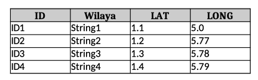

# Accelerograph Map Creator

This Python script, `create_accelerograph_map.py`, creates a detailed map of North Algeria with various elements and annotations. It uses PyGMT, Pandas, Geopandas, and other libraries to generate this map, which can be used for a wide range of geographical presentations.

## Prerequisites

Before running the script, ensure that you have the following prerequisites installed:

- [Python](https://www.python.org/): The script is written in Python, so you need to have Python installed on your system.

- [PyGMT](https://www.pygmt.org/latest/install.html): This script relies on the PyGMT library, which is used for generating the map.

- [Pandas](https://pandas.pydata.org/docs/getting_started/index.html): The script uses Pandas to read Excel files and create data frames.

- [Geopandas](https://geopandas.org/en/stable/docs/install.html): Geopandas is used to work with shapefiles and geographical data.

## Usage

1. Clone this repository to your local machine or download the `create_accelerograph_map.py` script.

2. Ensure you have the necessary Excel files. The script expects two Excel files:
   - `ETNA2.xlsx`
   - `ETNA.xlsx`

   The Excel files should have these exact column names: ID, Wilaya, LAT, and LONG. See the image below:



	*IMPORTANT: Make sure that the float numbers are written with a point "." and not a comma ",".*

	In addition, you need a file containing your logo, and a shapefile with the city borders. All these files can be made optional by modifying the script to your needs.

3. Save these Excel files in this script directory.

   You can modify the  file paths in the script if needed.

4. Run the script using your Python interpreter.

   ```bash
   python create_accelerograph_map.py
   ```

5. The script will create a map and save it as `Reseau National daccelerographe.png` in the current working directory.

## Script Details

### Map Elements

The script creates a detailed map with the following elements and annotations:

- A map of North Algeria with a title: "Réseau National Algérien d'Accélérographes."

- Plotting of stations with different symbols and colors based on data frames.

- Addition of a north arrow, country names, sea names, date of creation, and a logo.

- A legend that contains a map scale, keys (symbols, types, numbers of stations), and a map of the world with Algeria highlighted.

### Modifying Map Region

You can modify the map region by changing the `xmin`, `xmax`, `ymin`, and `ymax` variables within the script to define your desired region.

### Saving the Map

The final map is saved as `Reseau National daccelerographe.png` in the current working directory.

## Author

[Yasmine ACHEMINE]

## License

This project is licensed under the MIT License - see the [LICENSE](LICENSE) file for details.

## Acknowledgments

- The script utilizes the powerful PyGMT library for map generation.
- It uses Pandas for handling data frames.
- Geopandas is used to work with shapefiles and geographical data.

Feel free to modify and extend this script to suit your specific needs. Enjoy creating detailed geographical maps with ease!

## Author
    Author: [Yasmine ACHEMINE]
    Date: [June 5, 2023]
